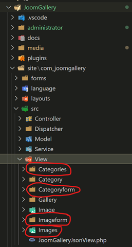

#  User Panles Code 

Mit diesen vier Ansichten sollte sich die Frontend-Bearbeitung umsetzen lassen.

- Categories (Administrator-Liste der Kategorien)
- Categoryform (Kategorie Bearbeiten Formular)
- Images (Administrator-Liste der Bilder)
- Imageform (Bild Bearbeiten Formular)

Mit diesen vier Ansichten sollte sich die Frontend-Bearbeitung umsetzen lassen.

