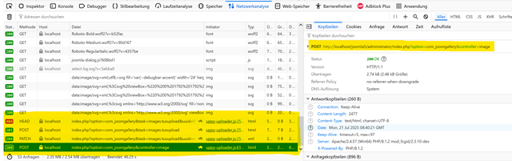

# Upload process steps

WIP

## Messages Post/...

1) First ?post? 

? First send 

http://127.0.0.1/joomgallery5x_dev/index.php?option=com_joomgallery&task=userupload.tusupload&uuid=3b3feb0ff4e53098a38f6b6ffea28d15

exxecute: $task === 'tusupload'

create tusserver (site/admin) => task  userimages.tusupload/images.tusupload
server->process

-> head
---------------------------

2) patch

Second or nth part of the image upload when image is big enough.

=====================================================

3) .......

jgprocessor 308

userupload

create tusserver (site/admin) => task  userimages.tusupload/images.tusupload
server->process

-> head

## comments on failings (21.07.2025)

1. Es braucht eine execute() Methode in den Frontend-Controllern, welche kontrollieren, ob ein tusupload gemacht werden soll und entsprechend den TUS server startet, statt Joomla weiter auszuführen. Zudem muss in dieser Methode die message queue zwischengespeichert wreden, weil die ajax requests diese messages von Joomla nicht verarbeiten kann.
Am besten schaust du, dass du die gesamte execute() Methode vom Backend auch im Frontend verfügbar und aktiv machst.
(administrator\com_joomgallery\src\Controller\JoomAdminController.php)

Kontrolliere, dass die Kommunikation nach dem klicken des Upload Buttons wie folgt aussieht:

