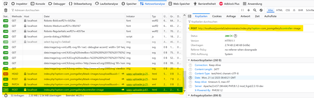

# Upload process steps

WIP

## Messages Post/...

### 1) post (header)

    % ... %

### 2) post (Prepare temp file and Meta data)

**==> JoomAdminController.execute: if($task === 'tusupload'):**

http://127.0.0.1/joomgallery5x_dev/index.php?option=com_joomgallery&task=userupload.tusupload&uuid=3b3feb0ff4e53098a38f6b6ffea28d15

execute: $task === 'tusupload'

create tusserver (site/admin) => task  userimages.tusupload/images.tusupload

server->process->post
* buildUuid: user id used as filename ?
* processPost: 
  * extractHeaders
  * ...
  * setMetadata:
  * setRealFileName: keep filename and filetype
    ```json
    {
    "id": "",
    "size": 0,
    "offset": 0,
    "extension": "",
    "filename": "2019-09-17_00004.jpg",
    "mimetype": "",
    "ispartial": true,
    "isfinal": false,
    "relativepath": "null",
    "name": "2019-09-17_00004.jpg",
    "type": "image/jpeg",
    "filetype": "image/jpeg"
    }
    ```
    file: web tmp / filename
  * 
  * 
  * 
  * 
  * 


---------------------------

### 3) patch (send parts of file)

**==> JoomAdminController.execute: if($task === 'tusupload'):**

Second or nth part of the image upload when image is big enough.


### 4) ajaxsave in image controller

**==> ImageController.ajaxsave:**

* Formcoontroller save()
    * context: com_joomgallery.edit.com_joomgallery.image.ajaxsave
    * task:ajaxsave
    * preprocessSaveData from 
    ```json
        {
        "debug": "1",
        "catid": "6",
        "title": "base",
        "nmb_start": "1",
        "author": "thomas",
        "published": "1",
        "access": "1",
        "language": "*",
        "description": "",
        "id": 0,
        "uploader": "tus",
        "multiple": "1",
        "uuid": "cd9ade6e0cf6ce79c16ee3a88212b9de",
        "filecounter": "1"
    }
    ```
    * getForm with data
    * normalizeRequestData / validate, add tags, preSaveHook 

* ==> image model->save
?? depth
    * byAjax = true
    * importPlugins
    * uploadservice: tus from $data['uploader']
    * upload_multiple: yes from $data['multiple']
    * uploader => .../Service/uploader/TUSUploader.php
    * is img Uploaded ?
    * TusUploader: Retrieve image
        * is final
        * Errors
        * upload limit
        * src: name, size, tmp path
        * parent::retrieveImage($data, $filename))
            * ? new filename 
            * 
            * 
        * 
        * 
        * 
        * 
        * -----------------------
        * Move file to new name + permission in /tmp
    * model save(): 
??        * tusuploader: overrideData (Metadata)
            * ? MetaDataValue('jdescription')
            * Delete info file 
            * Uploader: overrideData
                * createFilesystem
                * createMetadata with metaprocessor by config
                * readMetadata / assign metadata
                * jg_replaceinfo by config
                * ? add warning / log: COM_JOOMGALLERY_SERVICE_DEBUG_REPLACE_  Target: 'date'
                * 
        * Filemanager
        * $table->bind($data)
    * prepareTable ($table->ordering by config)
    * table check: on false rollback
    * Trigger the before save event.
    * => store the data
    * Create images
    * 
    * 
    * 
    * 
    * 


=====================================================


3) .......


jgprocessor 308

userupload

create tusserver (site/admin) => task  userimages.tusupload/images.tusupload
server->process

-> head


## comments on failings (21.07.2025)

1. Es braucht eine execute() Methode in den Frontend-Controllern, welche kontrollieren, ob ein tusupload gemacht werden soll und entsprechend den TUS server startet, statt Joomla weiter auszuführen. Zudem muss in dieser Methode die message queue zwischengespeichert wreden, weil die ajax requests diese messages von Joomla nicht verarbeiten kann.
Am besten schaust du, dass du die gesamte execute() Methode vom Backend auch im Frontend verfügbar und aktiv machst.
(administrator\com_joomgallery\src\Controller\JoomAdminController.php)

Kontrolliere, dass die Kommunikation nach dem klicken des Upload Buttons wie folgt aussieht:




